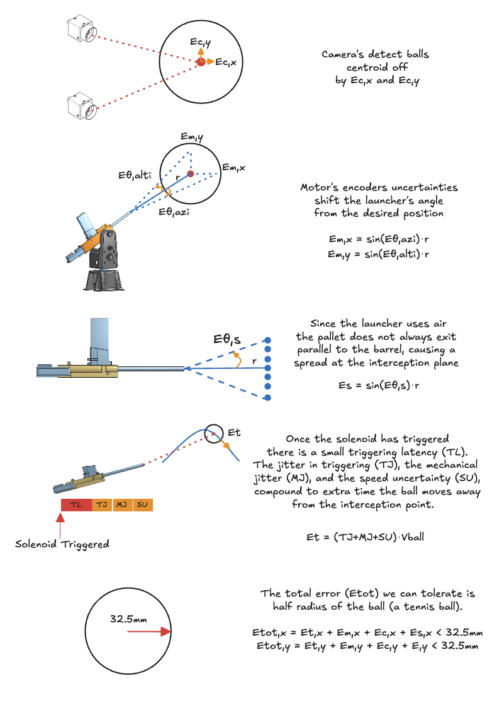
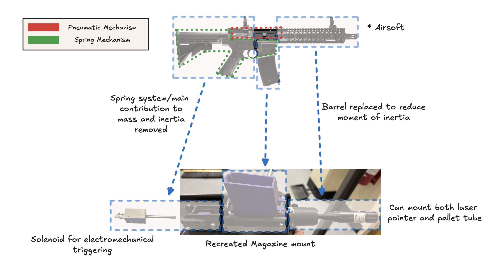
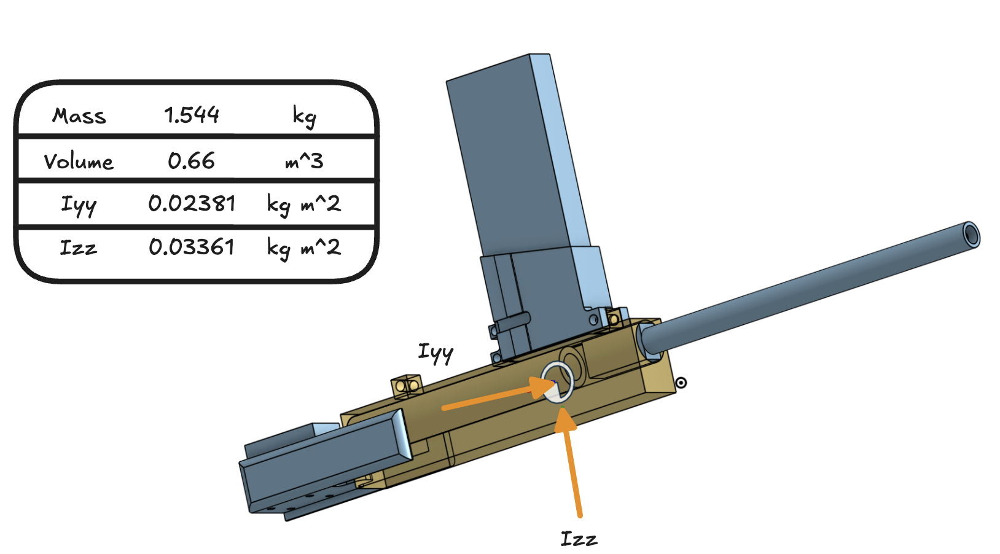

# Beer Pong Sentinel Project
This page contains a detailed description of the Beer Pong Sentinel capstone project for [ENPH 479](https://projectlab.engphys.ubc.ca/enph-459-479/) course at UBC.

## Background

### Error, Latency, Jitter, and Uncertainty

Our estimates for all the erros are provided in the table below.
|Source| Symbol | Quantity | Units |Notes|
|----------|----------|----------|----------|----------|
|Cameras|Ec|||||
|Motors - Azimuth|Eθ,azi|0.450|Degrees| Manufacturer data|
|Motors - Altitude|Eθ,alti|0.057|Degrees|Manufacturer data|
|Pneumatic Mechanism| Eθ,s|0.00485| Radians | Maximum measured spread|
|Electromechanical Jitter| Et|1.2|milliseconds| Maximum measured jitter| 

_Why have different units?_\
We would like to get the most accurate estimation for the maximum error in our system. For that reason we comply with the manufacturer choice of unit, and covert the units only when plugging into the final error estimation. 

_Note_: We are assuming the pallet travels at around the speed the manufacturer claims *131meters per seconds*.

## Electrical
### Layout

### Components
|Designation| Description | Part Number | Amount | Datasheet |
|----------|----------|----------|----------|----------|
|CM| Blackfly S Camera   | BFS-U3-04S2C-C  | 2   |[Teledyne](https://www.teledynevisionsolutions.com/products/blackfly-s-usb3/?model=BFS-U3-04S2C-C&vertical=machine%20vision&segment=iis)|
|MAZ| Stepper Motor   | CPM-SDSK-3421S-RLN  | 1   |[Teknic](https://teknic.com/model-info/CPM-SDSK-3421S-RLN/?model_voltage=48VDC)|
|MAL|SDK Motor   | CPM-SCSK-3411S-ELNB  | 1   |[Teknic](https://teknic.com/model-info/CPM-SCSK-3411S-ELNB/?model_voltage=75)   |
|PS1| Motor Power Supply | IPC-5 | 1 | [Teknic](https://teknic.com/products/servo-motor-dc-power-supply/)|
|PS2| 24VDC Power Supply | SE-450-24 | 1 |[Mouser](https://www.mouser.ca/ProductDetail/MEAN-WELL/SE-450-24?qs=M1W9nuUSIjpXT24%252B6%252BDJCg%3D%3D&srsltid=AfmBOoo0Gw3eBcZ0qDYIleJDajS5qSaI-gmjeNrVGrdYgwfqYw6543Ys)|
|SC| Motor Control Hub   | SC4-HUB  | 1   |[Teknic](https://teknic.com/sc4-hub/)   |
|SL| 24V Solenoid 42N   | 10MM JF-1253B   | 1   |[ Lee's Electronics](https://leeselectronic.com/en/product/4408-12v-solenoid-42n-10mm-jf-1253b.html)   |
|TC - N/A| Voltage regulator   | LM7805   | 1  | [Texas Instruments](https://www.ti.com/lit/ds/symlink/lm340.pdf)   |
|TC - D2| Diode    | 1N4007   | 1   | [Vishay](https://www.vishay.com/docs/88503/1n4001.pdf)   |
|TC - Q1| MOSFET    | IRF540   | 1   | [Vishay](https://www.vishay.com/docs/91021/irf540.pdf)   |
|TC - Q2/Q3| BJT    | 2N3904   | 2   | [Onsemi](https://www.onsemi.com/download/data-sheet/pdf/2n3903-d.pdf)   |

### Connections
| Designation | Description | Part Number  | Amount | Link|
|----------|----------|----------|----------|----------|
| MPC | Motors Power Cable | CPM-CABLE-PWR-MS120  | 2 | [Teknic](https://teknic.com/cpm-cable-pwr-ms120/) |
| MDC | Motors Data Cable | CPM-CABLE-CTRL-MU120  | 2 | [Teknic](https://teknic.com/CPM-CABLE-CTRL-MU120/) |
|PSC| Power Supply Cable| IPC35-CABLE110 | 1 |[Teknic](https://teknic.com/ipc35-cable110/)|
|HR10| Camera GPIO Cable| HR10A-7P-6S | 1 |[Teledyne](https://www.teledynevisionsolutions.com/products/hirose-hr10-6-pin-circular-connector/)|
|C1| USB-A to USB-B|  | 2 ||
|C2| Micro USB to USB-B/C|  | 2 ||
|C3| 2-pin Molex to Ring Connector | |2||
|C4| USB3 to Micro-B | |2||
|SJ| Jumber Wire|  | 2| | 

### Solenoid Control Circuit
_Note:_ The physical circuit in the current setup of the project is not the printed PCB, but a breadboard version without the option for a manual control and a 5V voltage regulator that steps down the 24V for the solenoid.

The full KiCAD design for the solenoid control PCB can be found under sol_ctrl_pcb

## Mechanical 
### Launcher Modifications

### Components
### CAD Models
|  | | |
|----------|----------|----------|
### Assembly 

### Launcher's Moment of Interia
Getting the moment of interia for the launcher plays a key role in the design and motor selection.

The below figure shows our CAD model of the launcher with it's mechanical parameters. The marker/arrows indicate the mounting location for the launcher.

The launcher's model was built by weighting its various components and recreating the rough or exact shapes of its components. The result parameter should be considered as a lower bound. We recommend using a factor of safety of 1.5 at least in any calculations that include this parameters.

[launcher Model](https://cad.onshape.com/documents/76652a767c23fe435988178b/w/9803612b38e4d7d0dd289d8c/e/d43adc66a7cc15ee7d39c4dd?renderMode=0&uiState=67d88cabb3e65b43110218b9)

## Firmware
The full firmware project can be found under the firmware folder.\
Our firmware runs on an Arduino Uno. 

### Firmware's Parameters
**_Solenoid Pulse Width:_**
Location: firmware\
Variable: TRIGGERING_DELAY\
Scale: Miliseconds\
Current Settings: 75\
Considerations: 
- Time needs to be enough to allow for the solenoid to provide optimal force to release the valve that open the magazine and releases air. 
- Time cannot be to long as it will cause the valve to be open for longer and release too much air. 

**_Step Signal Pulse Width:_**
Location: firmware\
Variable: AZI_DELAY\
Scale: Microseconds\
Current Settings: 100\
Considerations: 
- Minimum specification of motor control must be met
- Rise/fall time affect on the pulse
- Motor minimum control voltage is 5V
- Affect on motion profile; how steps in certain frequencies translate to different velocities

_Note:_ Currently this sets both the pulse width and the frequency of pulses as the high time and low time are symmetric. This can be changed.

**_Azimuth Motor Settlement Range:_**
Location: ClearPath MSP

**_Azimuth Motor Settlement Delay:_**
Location: ClearPath MSP

**_Altitude Motor Settlement Range:_**
Location: ClearView 

**_Altitude Motor Settlement Delay:_**
Location: ClearView 

## Camera system

### Camera's Parameters

## Software
