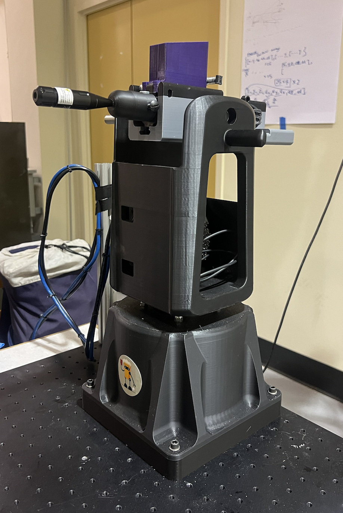

# Beer Pong Sentinel Project
This page contains a detailed description of the Beer Pong Sentinel capstone project for [ENPH 479](https://projectlab.engphys.ubc.ca/enph-459-479/) course at UBC.

## Background
The inspiration for this project came from an innocent university game - beer pong.
We thought - “what if, we can build a robot that can intercept all of our rival’s shots!”

This inspired to construct a small scale “aerial defence” setup for us to explore similar setting to beer pong.
Our goal is to deflect a target reaching a zone at the edge of a table using an interception system.

### General Interception Process


The small animation shows the different high level stages our system has to take to intercept a ball.

First you see the general setup of our system, and it's different comppnents.
Than we see the ball is in the air -> our camera detects a first image of it -> more pictures are collected -> a predicted path for the ball is produced -> launcher moves to a predicted interception position -> launcher is triggered to intecept a ball.

### Error, Latency, Jitter, and Uncertainty


Our estimates for all the erros are provided in the table below.
|Source| Symbol | Quantity | Units |Notes|
|----------|----------|----------|----------|----------|
|Integration|Ei|N/A||Need to collect data|
|Cameras|Ec|0.3-0.8|Pixels|Result of camera's triangulation|
|Motors - Azimuth|Eθ,azi|0.450|Degrees| Manufacturer data|
|Motors - Altitude|Eθ,alti|0.057|Degrees|Manufacturer data|
|Pneumatic Mechanism| Eθ,s|0.00485| Radians | Maximum measured spread|
|Electromechanical Jitter| Et|1.2|milliseconds| Maximum measured jitter| 

_Why have different units?_\
We would like to get the most accurate estimation for the maximum error in our system. For that reason we comply with the manufacturer choice of unit, and covert the units only when plugging into the final error estimation. 

_Note_: We are assuming the pallet travels at around the speed the manufacturer claims *131meters per seconds*.


## Electrical
### Layout


### Components
|Designation| Description | Part Number | Amount | Datasheet |
|----------|----------|----------|----------|----------|
|CM| Blackfly S Camera   | BFS-U3-04S2C-C  | 2   |[Teledyne](https://www.teledynevisionsolutions.com/products/blackfly-s-usb3/?model=BFS-U3-04S2C-C&vertical=machine%20vision&segment=iis)|
|MAZ| Stepper Motor   | CPM-SDSK-3421S-RLN  | 1   |[Teknic](https://teknic.com/model-info/CPM-SDSK-3421S-RLN/?model_voltage=48VDC)|
|MAL|SDK Motor   | CPM-SCSK-3411S-ELNB  | 1   |[Teknic](https://teknic.com/model-info/CPM-SCSK-3411S-ELNB/?model_voltage=75)   |
|PS1| Motor Power Supply | IPC-5 | 1 | [Teknic](https://teknic.com/products/servo-motor-dc-power-supply/)|
|PS2| 24VDC Power Supply | SE-450-24 | 1 |[Mouser](https://www.mouser.ca/ProductDetail/MEAN-WELL/SE-450-24?qs=M1W9nuUSIjpXT24%252B6%252BDJCg%3D%3D&srsltid=AfmBOoo0Gw3eBcZ0qDYIleJDajS5qSaI-gmjeNrVGrdYgwfqYw6543Ys)|
|SC| Motor Control Hub   | SC4-HUB  | 1   |[Teknic](https://teknic.com/sc4-hub/)   |
|SL| 12V Solenoid 42N   | 10MM JF-1253B   | 1   |[ Lee's Electronics](https://leeselectronic.com/en/product/4408-12v-solenoid-42n-10mm-jf-1253b.html)   |
|TC - N/A| Voltage regulator   | LM7805   | 1  | [Texas Instruments](https://www.ti.com/lit/ds/symlink/lm340.pdf)   |
|TC - D2| Diode    | 1N4007   | 1   | [Vishay](https://www.vishay.com/docs/88503/1n4001.pdf)   |
|TC - Q1| MOSFET    | IRF540   | 1   | [Vishay](https://www.vishay.com/docs/91021/irf540.pdf)   |
|TC - Q2/Q3| BJT    | 2N3904   | 2   | [Onsemi](https://www.onsemi.com/download/data-sheet/pdf/2n3903-d.pdf)   |

### Connections
| Designation | Description | Part Number  | Amount | Link|
|----------|----------|----------|----------|----------|
| MPC | Motors Power Cable | CPM-CABLE-PWR-MS120  | 2 | [Teknic](https://teknic.com/cpm-cable-pwr-ms120/) |
| MDC | Motors Data Cable | CPM-CABLE-CTRL-MU120  | 2 | [Teknic](https://teknic.com/CPM-CABLE-CTRL-MU120/) |
|PSC| Power Supply Cable| IPC35-CABLE110 | 1 |[Teknic](https://teknic.com/ipc35-cable110/)|
|HR10| Camera GPIO Cable| HR10A-7P-6S | 1 |[Teledyne](https://www.teledynevisionsolutions.com/products/hirose-hr10-6-pin-circular-connector/)|
|C1| USB-A to USB-B|  | 2 ||
|C2| Micro USB to USB-B/C|  | 2 ||
|C3| 2-pin Molex to Ring Connector | |2||
|C4| USB3 to Micro-B | |2||
|SJ| Jumber Wire|  | 2| | 


### Solenoid Control Circuit
_Note:_ The physical circuit in the current setup of the project is not the printed PCB, but a breadboard version without the option for a manual control and a 5V voltage regulator that steps down the 24V for the solenoid.

The full KiCAD design for the solenoid control PCB can be found under sol_ctrl_pcb

## Mechanical 
### Safety 
The original airsoft we got for this project is the [Crosman R1 Full-Auto - Black](https://www.crosman.com/product/crosman-full-auto-r1-black-bb/).\
The pneumatic mechanism requires two [12-gram Powerlet CO2 Cartridges](https://www.crosman.com/product/crosman-12-gram-powerlet-co2-cartridges/).\
This airsoft/magazine uses [4.5mm copper pellets](https://www.crosman.com/product/crosman-copperhead-bbs/).

When testing the airsoft pneumatic mechanism/using it, especially in a closed room, make sure to wear face protection. The pellets are copper and tend to bouce around. This will happen after a while even if you have a cardboard stack target. 

*To learn more about saftey and replacing gas cartridges:* head to the safety folder and read about saftey of operating the airsoft in testing locations and how to safely replace the gas cartridges for the pneumatic mechanism. 

### Launcher Modifications


The main rational behind modifing the original airsoft is to reduce the mass, size, and moment of intertia to allow up to actuate our launcher with ease. A larger, weirdly shaped, launcher would have required but more expensive motors and a more rigid design of the launcher mounts. 

### Launcher's Moment of Interia
Getting the moment of interia for the launcher plays a key role in the design and motor selection.

The below figure shows our CAD model of the launcher with it's mechanical parameters. The marker/arrows indicate the mounting location for the launcher.

The launcher's model was built by weighting its various components and recreating the rough or exact shapes of its components. The result parameter should be considered as a lower bound. We recommend using a factor of safety of 1.5 at least in any calculations that include this parameters.

[launcher Model](https://cad.onshape.com/documents/76652a767c23fe435988178b/w/9803612b38e4d7d0dd289d8c/e/d43adc66a7cc15ee7d39c4dd?renderMode=0&uiState=67d88cabb3e65b43110218b9)


### Motor Selection
To select motors we ran simulations of motion profiles using both the intertia of our launcher and the rotos intertia of some promessing motors. 
We simulate both a triangular motion profile, which assumes instant change from acceleration to de-acceleration, and a trapaziodal motion profile, which assumes equal time in acceleration, operation in max acceleration, and deacceleration. 

While both are not perfect and can be improved, by giving assuming less time in max acceleration for example, they give us a good idea of the torque and velocities we will need to operate in to actuate our launcher. 

The model takes the following parameters:
```python
object_inertia 
motor_inertia 
theta_target 
time_window
safety_factor
```

We recommend being conservative with the safety factor to account for imperfections in tuning, intertia calculations, and motion profile control.\
An example of such trianguler motion profile can be seen below. 


_Note_:\
Something we learned in the hard way is that the rotor intertia should match the intertia of the load it drives. This mostly affects tuning the motor. In the case it does not match, you might want to gear the motor. This is not ideal as it will cause a lost in resolution of the encoder, but will provide better tuining. 

_Our problem_:\
Specificly with the motors we are using we found out that our altitude motor (SDK controlled) does not allow to limit the velocity for tuning. This causes the motor to torque saturate and to produce sub-optimal tuning. To mitigate this we created a program in our software to map the time it take to move to an angle with a certain velocity command. Creating a map of (velocity, angle) to (time taken). We than used/can use this to find the best (velocity, angle) command to use to minimize the time it takes to go to a location. 

These profiles can be ran for any internal parameters you can change in the motor. We only found that you can change the Jerk and the "Fine-tuning" (how stiff/quite the motor moves) in our altitude (SDK controlled) motor. 

Such mothion profiles with different jerks settings are shown below (the graphing script can be found under ./motor selection/Altitude Time Motion Profile Visualization.ipynb). 


[Mean time and std at velocity of 20rpm]

### Components
_Click to open OnShape CAD model_


|  | Description | Part Number  | Amount | Link|
|----------|----------|----------|----------|----------|
|  | Timing Belt Pulley 1.500" OD, for 1/2" Shaft Diameter | 6495K752  | 2 | [McMaster](https://www.mcmaster.com/6495K752/) |
|  | Rotary Shaft 1/2" Diameter, 6" Long | 4149N15  | 1 | [McMaster](https://www.mcmaster.com/4149N15/) |
|| Ball Bearing for 1/2" Shaft Diameter | 3 |[McMaster](https://www.mcmaster.com/60355K173/)|
|| Series Timing Belt| 6484K226 | 1 |[McMaster](https://www.mcmaster.com/6484K226/)|
||  Dry-Running Nylon Sleeve Bearing Flanged, for 1/2" Shaft Diameter and 3/4" Housing ID, 7/16" Long| 6389K233 | 2 |[McMaster](https://www.mcmaster.com/6389K233/)|
|| Carbon Steel Wide-Rim Ring, 0.048" Thick x 1/2" ID x 7/8" OD| 97669A200 | 1 (pack of 25) |[McMaster](https://www.mcmaster.com/6389K233/)|

### Launcher Mount and Maneuvering
| [](https://cad.onshape.com/documents/360e54d875f63ab4db6ef54b/w/d57eff492a0fd340cef803da/e/a90c483078f0a216147ba77b?renderMode=0&uiState=67cce1751ec0ed3d7ef3efa9) | [](https://cad.onshape.com/documents/360e54d875f63ab4db6ef54b/w/d57eff492a0fd340cef803da/e/af73ce29d204dcf42df93766)| [](https://cad.onshape.com/documents/360e54d875f63ab4db6ef54b/w/d57eff492a0fd340cef803da/e/c06067e56aa459f53e365584?renderMode=0&uiState=67cce03d75f3db0bee079528)|
|----------|----------|----------|
### Assembly 

[](https://cad.onshape.com/documents/360e54d875f63ab4db6ef54b/w/d57eff492a0fd340cef803da/e/76fc739196417cc4943c6696?renderMode=0&uiState=67cce26e1ec0ed3d7ef3f115)


## Firmware
The full firmware project can be found under the firmware folder.\
Our firmware runs on an Arduino Uno. 


### Firmware's Parameters
**_Solenoid Pulse Width:_**\
Location: firmware\
Variable: TRIGGERING_DELAY\
Scale: Miliseconds\
Current Settings: 75\
Considerations: 
- Time needs to be enough to allow for the solenoid to provide optimal force to release the valve that open the magazine and releases air. 
- Time cannot be to long as it will cause the valve to be open for longer and release too much air. 

**_Step Signal Pulse Width:_**\
Location: firmware\
Variable: AZI_DELAY\
Scale: Microseconds\
Current Settings: 100\
Considerations: 
- Minimum specification of motor control must be met
- Rise/fall time affect on the pulse
- Motor minimum control voltage is 5V
- Affect on motion profile; how steps in certain frequencies translate to different velocities

_Note:_ Currently this sets both the pulse width and the frequency of pulses as the high time and low time are symmetric. This can be changed.

**_Azimuth Motor Settlement Range:_**\
Location: ClearPath MSP\
Access: Advanced -> High-Level Feedback (HLFB) Setup -> In-Range Position Window (ctns)\
Current Settings: 1\
Notes: Current HLFB Output setting is All System Go (ASG) - Position\
Considerations: 
- Azimuth motor has a smaller encoder resolution than altitude
- See altitude considerations

**_Azimuth Motor Settlement Delay:_**\
Location: ClearPath MSP\
Access: Advanced -> High-Level Feedback (HLFB) Setup -> Verify Time (ms)\
Current Settings: 10.1\
Notes: Current HLFB Output setting is All System Go (ASG) - Position\
Considerations: 
- Azimuth motor tuning runs better the altitute
- See altitude considerations

**_Altitude Motor Settlement Range:_**\
Location: ClearView\
Access: Details -> Move Status Indicators... -> In-Range Position Window (ctns)\
Current Settings: 5\
Considerations:
- We have some tolerance for error so we can settle within some range of the encoder ctns
- Moving faster might take priority.

**_Altitude Motor Settlement Delay:_**\
Location: ClearView 
Access: Details -> Move Status Indicators... -> Verify Time (msec)\
Current Settings: 10.1\
Considerations:
- Move done might given more than once if the launcher oscillates around a point.
- More delay means more latency before we can trigger.

## Camera system

### Camera's Parameters

### Intrinsic/Extrinsic Callibration 


We use stereo calibration to to correct for lens distortions and determine the precise relative placement of two cameras. We use a printed chessboard pattern of known dimensions, by taking images at various positions and orientations. By analyzing these images, the calibration algorithm uses the known geometry of the chessboard to first estimate and correct each camera’s intrinsic parameters—thus “undistorting” the images. It then compares corresponding points in both camera views to determine the cameras’ relative positions and orientations. These calibration results, which include both the intrinsic corrections and the extrinsic parameters describing how the cameras are arranged, can be combined into a projection matrix that enables the reconstruction of a 3D point in world space from the two camera images.

### Color Detection

### Yolo-OpenCV Object Detection 

### Cameras-Launcher Callibration


*The algorithem*
- Launcher only moves to discrete encoder pairs [altitude, azimuth]

- Move launcher to a set of encoder pairs

- Record camera coordinates on a plane a distance r1 away 

- Repeat for distance r2

- Interpolate the rest of the points


### Background Subtraction

## Software

### Dependencies 

### Programs
#### Chessboard Calibration

#### Lookup Table Construction

#### Altitude Motion Profile

#### Color Detection


### Prediction

## Our System In Real Life

### Lacunher - Beerie


### Integration Box
Our full integrated circuitry connects all components together through a single hub USB hub for a simple connection.
Labels and markers, with detailed diagrams, make setting up quick and simple.


### Calibration Chessboard
Our 80cm x 60cm calibration chessboard is sandwidched between two acrylic plates, making it as flat as possible. 


### Aiming/Look up table callibration
