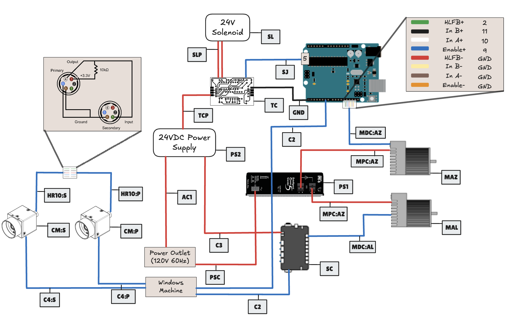

# Beer Pong Sentinel Project
This page contains a detailed description of the Beer Pong Sentinel capstone project for [ENPH 479](https://projectlab.engphys.ubc.ca/enph-459-479/) course at UBC.

## Background

## Electrical
### Layout

### Components
|Designation| Description | Part Number | Amount | Datasheet |
|----------|----------|----------|----------|----------|
|MAZ| Stepper Motor   | CPM-SDSK-3421S-RLN  | 1   |[Teknic](https://teknic.com/model-info/CPM-SDSK-3421S-RLN/?model_voltage=48VDC)|
|MAL|SDK Motor   | CPM-SCSK-3411S-ELNB  | 1   |[Teknic](https://teknic.com/model-info/CPM-SCSK-3411S-ELNB/?model_voltage=75)   |
|PS1| Motor Power Supply | IPC-5 | 1 | [Teknic](https://teknic.com/products/servo-motor-dc-power-supply/)|
|PS2| 24VDC Power Supply | SE-450-24 | 1 |[Mouser](https://www.mouser.ca/ProductDetail/MEAN-WELL/SE-450-24?qs=M1W9nuUSIjpXT24%252B6%252BDJCg%3D%3D&srsltid=AfmBOoo0Gw3eBcZ0qDYIleJDajS5qSaI-gmjeNrVGrdYgwfqYw6543Ys)|
|SC| Motor Control Hub   | SC4-HUB  | 1   |[Teknic](https://teknic.com/sc4-hub/)   |
|SL| 24V Solenoid 42N   | 10MM JF-1253B   | 1   |[ Lee's Electronics](https://leeselectronic.com/en/product/4408-12v-solenoid-42n-10mm-jf-1253b.html)   |
|TC - N/A| Voltage regulator   | LM7805   | 1  | [Texas Instruments](https://www.ti.com/lit/ds/symlink/lm340.pdf)   |
|TC - D2| Diode    | 1N4007   | 1   | [Vishay](https://www.vishay.com/docs/88503/1n4001.pdf)   |
|TC - Q1| MOSFET    | IRF540   | 1   | [Vishay](https://www.vishay.com/docs/91021/irf540.pdf)   |
|TC - Q2/Q3| BJT    | 2N3904   | 2   | [Onsemi](https://www.onsemi.com/download/data-sheet/pdf/2n3903-d.pdf)   |

### Connections
| Designation | Description | Part Number  | Amount | Link|
|----------|----------|----------|----------|----------|
| MPC | Motors Power Cable | CPM-CABLE-PWR-MS120  | 2 | [Teknic](https://teknic.com/cpm-cable-pwr-ms120/) |
| MDC | Motors Data Cable | CPM-CABLE-CTRL-MU120  | 2 | [Teknic](https://teknic.com/CPM-CABLE-CTRL-MU120/) |
|PSC| Power Supply Cable| IPC35-CABLE110 | 1 |[Teknic](https://teknic.com/ipc35-cable110/)|
|C1| USB-A to USB-B|  | 2 ||
|C2| Micro USB to USB-B/C|  | 2 ||
|C3| 2-pin Molex to Ring Connector | |2||
|SJ| Jumber Wire|  | 2| | 

### Solenoid Control Circuit
_Note:_ The physical circuit in the current setup of the project is not the printed PCB, but a breadboard version without the option for a manual control and a 5V voltage regulator that steps down the 24V for the solenoid.

The full KiCAD design for the solenoid control PCB can be found under sol_ctrl_pcb

## Mechanical 
### Components
### CAD Models
|  | | |
|----------|----------|----------|
### Assembly 

## Firmware
The full firmware project can be found under the firmware folder.
Our firmware runs on an Arduino Uno. 

### Firmware's Parameters
**_Solenoid Pulse Width:_**
Location: firmware
Variable: TRIGGERING_DELAY
Scale: Miliseconds
Current Settings: 75
Considerations:

**_Step Signal Pulse Width:_**
Location: firmware
Variable: AZI_DELAY
Scale: Microseconds
Current Settings: 100
Considerations:

_Note:_ Currently this sets both the pulse width and the frequency of pulses as the high time and low time are symmetric. This can be changed.

**_Azimuth Motor Settlement Range:_**
Location: ClearPath MSP

**_Azimuth Motor Settlement Delay:_**
Location: ClearPath MSP

## Camera system

### Camera's Parameters

## Software
