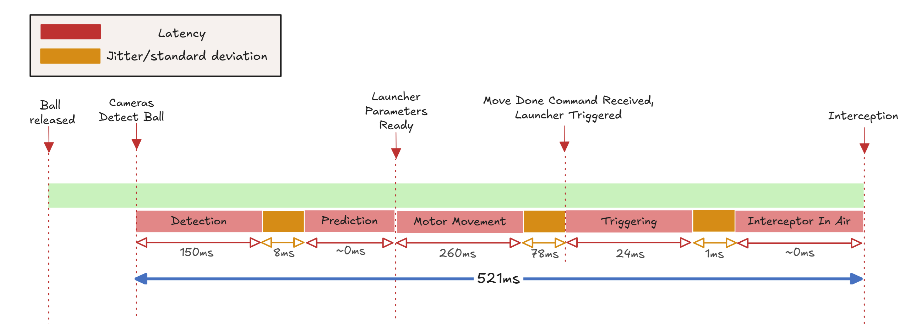
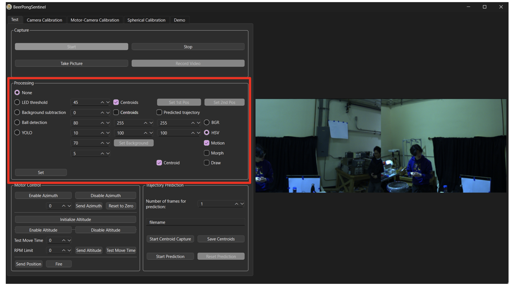

# Beer Pong Sentinel Project
This page contains a detailed description of the Beer Pong Sentinel project for the Engineering Physics capstone course at UBC.

## Our Team

|  |  |  |  |
|:-----------------------:|:------------------------:|:-------------------------:|:------------------------:|
| **Harry Hu**           | **Eldad Zipori**         | **Polina Shopina**        | **Brian Yan**            |
| [LinkedIn](https://www.linkedin.com/in/harrytyhu/) | [LinkedIn](https://www.linkedin.com/in/eldad-zipori-a411a5157/) | [LinkedIn](https://www.linkedin.com/in/polina-shopina/) | [LinkedIn](https://www.linkedin.com/in/brian-yan/) |


## Background
The inspiration for this project came from an innocent university game - beer pong.
We thought, “it would be pretty cool to build a robot that could intercept all of our opponent's shots”! 

Although we've pivoted away from ping pong balls to the larger and more predictable tennis balls, our goal remains the same: to prevent a target from reaching a zone at the edge of a table using an interception system.

### General Interception Process


The small animation shows the different high level stages our system has to take to intercept a ball.

First you see the general setup of our system, and it's different components. The remaining steps are as follows:
* our cameras detect a tennis ball in the air and triangulate its 3D location
* our cameras continue capturing frames until we have enough data to predict the target's trajectory
* we compute the predicted trajectory and based on our understanding of system latency, determine where along the trajectory to intercept the target
* we rotate our launcher in the altitude and azimuth directions
* we trigger the launcher to fire an interceptor at the right time

### Error, Latency, Jitter, and Uncertainty


The last error we need to account for is the error in the prediction itself. This comes from the differences in actual ball trajectories vs the trajectory we predict for them. To measure this simply compare  a trajectory of a ball from a video, to a predicted trajectory. Most of the work on this is done and can be found in (...).

Our estimates for all the errors are provided in the table below.
|Source| Symbol | Quantity | Units |Notes|
|----------|----------|----------|----------|----------|
|Prediction|Ep|N/A||Need to collect data|
|Integration|Ei|N/A||Need to collect data|
|Cameras|Ec|0.3-0.8|Pixels|Result of camera's triangulation|
|Motors - Azimuth|Eθ,azi|0.450|Degrees| Manufacturer data|
|Motors - Altitude|Eθ,alti|0.057|Degrees|Manufacturer data|
|Pneumatic Mechanism| Eθ,s|0.00485| Radians | Maximum measured spread|
|Electromechanical Jitter| Et|1.2|milliseconds| Maximum measured jitter| 

_Note_: The integration error Ei encapsulates the error in the cameras and the motors when trying to aim at a target after motor-calibration. It can be thought of as the shortest distance between a laser beam collinear with the launch barrel and a stationary target's centroid.

_Note_: Some values such as the integration error Ei are not calculated yet. Prediction is only theoretical as we did not fully integrate it. 

<!-- _Why have different units?_\
We would like to get the most accurate estimation for the maximum error in our system. For that reason we comply with the manufacturer choice of unit, and covert the units only when plugging into the final error estimation.  -->

<!-- _Note_: We are assuming the pallet travels at around the speed the manufacturer claims *131meters per seconds*. -->

### Interception Timeline
To truly understand this project you will need to understand the timeline in which the system operate. This might take a few seconds (or a few months).

The important thing to note here that prediction is implemented assuming worst-case latency for all processes. This means that the only jitter that affects our interception error is the electromechanical jitter in our triggering mechanism as we always wait a constant amount of time before firing.

<!-- Since the launcher provide a move done command, we recommend to always choose an interception point as if all jitter before the move done actually happens, this will cause the error in interception to come only from actions taken after the move done status (plus the error from the LUT itself.).

This makes the main challenge problem of interception the timing of the triggering itself. This is since all error's are measureable.  -->


## Electrical
### Layout


### Components
|Designation| Description | Part Number | Amount | Datasheet |
|----------|----------|----------|----------|----------|
|CM| Blackfly S Camera   | BFS-U3-04S2C-C  | 2   |[Teledyne](https://www.teledynevisionsolutions.com/products/blackfly-s-usb3/?model=BFS-U3-04S2C-C&vertical=machine%20vision&segment=iis)|
|MAZ| Stepper Motor   | CPM-SDSK-3421S-RLN  | 1   |[Teknic](https://teknic.com/model-info/CPM-SDSK-3421S-RLN/?model_voltage=48VDC)|
|MAL|SDK Motor   | CPM-SCSK-3411S-ELNB  | 1   |[Teknic](https://teknic.com/model-info/CPM-SCSK-3411S-ELNB/?model_voltage=75)   |
|PS1| Motor Power Supply | IPC-5 | 1 | [Teknic](https://teknic.com/products/servo-motor-dc-power-supply/)|
|PS2| 24VDC Power Supply | SE-450-24 | 1 |[Mouser](https://www.mouser.ca/ProductDetail/MEAN-WELL/SE-450-24?qs=M1W9nuUSIjpXT24%252B6%252BDJCg%3D%3D&srsltid=AfmBOoo0Gw3eBcZ0qDYIleJDajS5qSaI-gmjeNrVGrdYgwfqYw6543Ys)|
|SC| Motor Control Hub   | SC4-HUB  | 1   |[Teknic](https://teknic.com/sc4-hub/)   |
|SL| 12V Solenoid 42N   | 10MM JF-1253B   | 1   |[ Lee's Electronics](https://leeselectronic.com/en/product/4408-12v-solenoid-42n-10mm-jf-1253b.html)   |
|TC - N/A| Voltage regulator   | LM7805   | 1  | [Texas Instruments](https://www.ti.com/lit/ds/symlink/lm340.pdf)   |
|TC - D2| Diode    | 1N4007   | 1   | [Vishay](https://www.vishay.com/docs/88503/1n4001.pdf)   |
|TC - Q1| MOSFET    | IRF540   | 1   | [Vishay](https://www.vishay.com/docs/91021/irf540.pdf)   |
|TC - Q2/Q3| BJT    | 2N3904   | 2   | [Onsemi](https://www.onsemi.com/download/data-sheet/pdf/2n3903-d.pdf)   |

### Connections
| Designation | Description | Part Number  | Amount | Link|
|----------|----------|----------|----------|----------|
| MPC | Motors Power Cable | CPM-CABLE-PWR-MS120  | 2 | [Teknic](https://teknic.com/cpm-cable-pwr-ms120/) |
| MDC | Motors Data Cable | CPM-CABLE-CTRL-MU120  | 2 | [Teknic](https://teknic.com/CPM-CABLE-CTRL-MU120/) |
|PSC| Power Supply Cable| IPC35-CABLE110 | 1 |[Teknic](https://teknic.com/ipc35-cable110/)|
|HR10| Camera GPIO Cable| HR10A-7P-6S | 1 |[Teledyne](https://www.teledynevisionsolutions.com/products/hirose-hr10-6-pin-circular-connector/)|
|C1| USB-A to USB-B|  | 2 ||
|C2| Micro USB to USB-B/C|  | 2 ||
|C3| 2-pin Molex to Ring Connector | |2||
|C4| USB3 to Micro-B | |2||
|SJ| Jumber Wire|  | 2| | 


### Solenoid Control Circuit
_Note:_ The physical circuit in the current setup of the project is not the printed PCB, but a breadboard version without the option for a manual control and a 5V voltage regulator that steps down the 24V for the solenoid.

The full KiCAD design for the solenoid control PCB can be found inside `sol_ctrl_pcb`.

## Mechanical 
 
The original BB gun we got for this project is the [Crosman R1 Full-Auto - Black](https://www.crosman.com/product/crosman-full-auto-r1-black-bb/).\
The pneumatic mechanism requires two [12-gram Powerlet CO2 Cartridges](https://www.crosman.com/product/crosman-12-gram-powerlet-co2-cartridges/).\
This magazine uses [4.5mm copper pellets](https://www.crosman.com/product/crosman-copperhead-bbs/).

### Safety

When testing or operating the BB gun pneumatic mechanism/especially in a closed room, make sure to wear face protection. The pellets are copper and tend to bounce around. This will happen after a while even if you have a cardboard stack target. 

*To learn more about safety and replacing gas cartridges:* head to the `safety` folder and read about safety of operating the BB gun in testing locations and how to safely replace the gas cartridges for the pneumatic mechanism. 

### Launcher Modifications


The main rational behind modifying the original BB gun is to reduce the mass, size, and moment of inertia to allow up to actuate our launcher with ease. A larger, weirdly shaped, launcher would have required much more expensive motors and a more rigid design for the launcher mounts. 

### Launcher's Moment of Inertia
Calculating the moment of inertia for the launcher plays a key role in the design and motor selection.

The below figure shows our CAD model of the launcher with its mechanical parameters. The marker/arrows indicate the mounting location for the launcher.

The launcher's model was built by weighting its various components and recreating the rough or exact shapes of its components. The result parameter should be considered as a lower bound. We recommend using a factor of safety of 1.5 at least in any calculations that include these parameters.

[Onshape link for the launcher model](https://cad.onshape.com/documents/76652a767c23fe435988178b/w/9803612b38e4d7d0dd289d8c/e/d43adc66a7cc15ee7d39c4dd?renderMode=0&uiState=67d88cabb3e65b43110218b9)


### Motor Selection
To select motors we ran simulations of motion profiles using both the inertia of our launcher and the rotor inertia of some promising motors. 
We simulate both a triangular motion profile, which assumes instant change from acceleration to de-acceleration, and a trapezoidal motion profile, which assumes equal time in acceleration, operation in max acceleration, and deceleration. 

<!-- While both are not perfect and can be improved, by giving assuming less time in max acceleration for example, they give us a good idea of the torque and velocities we will need to operate in to actuate our launcher.  -->

The model takes the following parameters:
```python
object_inertia 
motor_inertia 
theta_target 
time_window
safety_factor
```

We recommend being conservative with the safety factor to account for imperfections in tuning, inertia calculations, and motion profile control.
An example of such triangular motion profile can be seen below. 


_Note_:\
Something we learned in the hard way is that the rotor inertia should match the inertia of the load it drives. This mostly affects tuning the motor. In the case it does not match, you might want to gear the motor. This is not ideal as it will cause a loss in resolution of the encoder, but will provide better tuning. 

_Our problem_:\
Specifically with the motors we are using we found out that our altitude motor (SDK controlled) does not allow to limit the velocity for tuning. This causes the motor to saturate in torque and to produce sub-optimal tuning. To mitigate this, we created a program in our software to map the time it take to move to an angle with a certain velocity limit. Creating a map of `(velocity, angle)` to `(time taken)`. We can use this to find the optimal maximum velocity to use to minimize the time it takes to go to any given angle. 

These profiles can be ran for any internal parameters you can change in the motor. We only found that you can change the Jerk and the "Fine-tuning" (how stiff/quite the motor moves) in our altitude (SDK controlled) motor. 

Such motion profiles with different jerk control settings are shown below (the graphing script can be found at [./motors/Altitude Time Motion Profile Visualization.ipynb](https://github.com/Beer-Pong-Sentinel/BeerPongSentinelMainframe/blob/main/motors/Altitude%20Time%20Motion%20Profile%20Visualization.ipynb)). 


From this analysis, we determined that using no jerk control and a velocity limit of 20 RPM produces the optimal jerk and latency over our range of possible altitude angles.

### Motor Tuning
Both motors need to to be tuned with ClearPath (azimuth) and ClearView (altitude). The tuning we are using can be found under the [./motors](https://github.com/Beer-Pong-Sentinel/BeerPongSentinelMainframe/tree/main/motors) folder with the timestamp and description.

_Important Last Minute Note:_ We found out that the calibration files are readable! That means that you can tune the motor by changing their parameters. A sub-project for this will be to make your own tuning program that will limit the velocity of the altitude motor and tune it well (though this is more Teknic's job).
### Components

| Description | Part Number  | Amount | Link|
|----------|----------|----------|----------|
| Timing Belt Pulley 1.500" OD, for 1/2" Shaft Diameter | 6495K752  | 2 | [McMaster](https://www.mcmaster.com/6495K752/) |
| Rotary Shaft 1/2" Diameter, 6" Long | 4149N15  | 1 | [McMaster](https://www.mcmaster.com/4149N15/) |
| Ball Bearing for 1/2" Shaft Diameter |60355K173| 3 |[McMaster](https://www.mcmaster.com/60355K173/)|
| Series Timing Belt| 6484K226 | 1 |[McMaster](https://www.mcmaster.com/6484K226/)|
|  Dry-Running Nylon Sleeve Bearing Flanged, for 1/2" Shaft Diameter and 3/4" Housing ID, 7/16" Long| 6389K233 | 2 |[McMaster](https://www.mcmaster.com/6389K233/)|
| Carbon Steel Wide-Rim Ring, 0.048" Thick x 1/2" ID x 7/8" OD| 97669A200 | 1 (pack of 25) |[McMaster](https://www.mcmaster.com/6389K233/)|

### Launcher Mount and Maneuvering
_Click to open OnShape CAD model_
| [](https://cad.onshape.com/documents/360e54d875f63ab4db6ef54b/w/d57eff492a0fd340cef803da/e/a90c483078f0a216147ba77b?renderMode=0&uiState=67cce1751ec0ed3d7ef3efa9) | [](https://cad.onshape.com/documents/360e54d875f63ab4db6ef54b/w/d57eff492a0fd340cef803da/e/af73ce29d204dcf42df93766)| [](https://cad.onshape.com/documents/360e54d875f63ab4db6ef54b/w/d57eff492a0fd340cef803da/e/c06067e56aa459f53e365584?renderMode=0&uiState=67cce03d75f3db0bee079528)|
|----------|----------|----------|
### Assembly 

[](https://cad.onshape.com/documents/360e54d875f63ab4db6ef54b/w/d57eff492a0fd340cef803da/e/76fc739196417cc4943c6696?renderMode=0&uiState=67cce26e1ec0ed3d7ef3f115)


## Firmware
The full firmware project can be found in the `firmware` folder. Our firmware runs on an Arduino Uno with the following pins connected. 


### Firmware Parameters
**_Solenoid Pulse Width:_**\
Location: firmware\
Variable: TRIGGERING_DELAY\
Scale: Miliseconds\
Current Settings: 75\
Considerations: 
- Time needs to be enough to allow for the solenoid to provide enough force to open the CO2 valve.
- Time should be too long as it wastes CO2.

**_Step Signal Pulse Width:_**\
Location: firmware\
Variable: AZI_DELAY\
Scale: Microseconds\
Current Settings: 100\
Considerations: 
- Minimum specification of motor control must be met
- Rise/fall time affect on the pulse
- Motor minimum control voltage is 5V
- Effect on motion profile; how steps in certain frequencies translate to different velocities

_Note:_ Currently this sets both the pulse width and the frequency of pulses as the high time and low time are symmetric. This can be changed.

**_Azimuth Motor Settlement Range:_**\
Location: ClearPath MSP\
Access: Advanced -> High-Level Feedback (HLFB) Setup -> In-Range Position Window (ctns)\
Current Settings: 1\
Notes: Current HLFB Output setting is All System Go (ASG) - Position\
Considerations: 
- Azimuth motor has a smaller encoder resolution than altitude
- See altitude considerations

**_Azimuth Motor Settlement Delay:_**\
Location: ClearPath MSP\
Access: Advanced -> High-Level Feedback (HLFB) Setup -> Verify Time (ms)\
Current Settings: 10.1\
Notes: Current HLFB Output setting is All System Go (ASG) - Position\
Considerations: 
- Azimuth motor tuning runs better the altitute
- See altitude considerations

**_Altitude Motor Settlement Range:_**\
Location: ClearView\
Access: Details -> Move Status Indicators... -> In-Range Position Window (ctns)\
Current Settings: 5\
Considerations:
- We have some tolerance for error so we can settle within some range of the encoder ctns
- Moving faster might take priority.

**_Altitude Motor Settlement Delay:_**\
Location: ClearView 
Access: Details -> Move Status Indicators... -> Verify Time (msec)\
Current Settings: 10.1\
Considerations:
- Move done might given more than once if the launcher oscillates around a point.
- More delay means more latency before we can trigger.

## Camera system

### Camera's Parameters
The full camera parameters can be found under `/simulations` and `data analysis/Camera Calculations.xlsx`.
This provides the full details of all the intrinsic parameters of the [BFS-U3-04S2C-C]((https://www.teledynevisionsolutions.com/products/blackfly-s-usb3/?model=BFS-U3-04S2C-C&vertical=machine%20vision&segment=iis)) cameras we are using, inluding some that require calculations. 


### Intrinsic/Extrinsic Calibration 


We use stereo calibration to to correct for lens distortions and determine the precise relative placement of two cameras. We use a printed chessboard pattern of known dimensions and take images at various positions and orientations. By analyzing these images, the calibration algorithm uses the known geometry of the chessboard to first estimate and correct each camera’s intrinsic parameters, “undistorting” the images. It then compares corresponding points in both camera views to determine the cameras’ relative positions and orientations. These calibration results, which include both the intrinsic corrections and the extrinsic parameters describing how the cameras are arranged, can be combined into a projection matrix that enables the reconstruction of a 3D point using an image from each camera.

You can find some calibration data under [./calibration data](https://github.com/Beer-Pong-Sentinel/BeerPongSentinelMainframe/tree/main/clibration data) . As long as the orientation of the two cameras with respect to each other does not change you might not need to re-calibrate. Note that under most new environments it is recommended to recalibrate.
### Color Detection
Initially we tried to detect a static target (tennis ball) using conventional methods such as HSV/RGB thresholding. 
This turned out to be more challenging than we thought, as the camera resolution is only 720x540.

While colors seem green, or red, to us, it is very clear in processing that a tennis ball contains a lot of non-green content. 
To fix this we tried a few things:
- Putting a black curtain in the background to more easily see the green tennis ball
- Increasing the saturation on the cameras making most of the view look red, but making green more clear to distinguish
- We used clear, consistent lighting that does not flicker and turned off all the other light sources in the room.

In order to intercept the ball at some point along its trajectory, we need to triangulate its position across 3D space both quickly and accurately. However, to triangulate the position of the ball, we need to determine the pixel coordinates of the center of the ball for each image from our two cameras. Thus, we need a robust image processing pipeline that can efficiently and consistently retrieve the centroid of a ball from an image.

We constructed the Ball Detection pipeline to accomplish this task which works as follows:

1. First, apply an HSV threshold to the image, which highlights only objects within a certain hue, saturation, and value range. 
2. Next, apply a MOG2 background subtraction to identify any moving objects in the image. 
3. Combine these two outputs in order to retrieve only moving objects which match the specified colors defined by the HSV range. 
4. Once combined, apply a dilation and erosion process to remove any noise. The final image should contain only highlighted pixels that match the position of the ball.
5. Lastly, find the centroid of the highlighted pixels for both camera's and pass these values to the triangulation function to determine the position of the ball in 3D space.

To read more about HSV and RGB thresholding, see [OpenCV's official documentation](https://docs.opencv.org/3.4/da/d97/tutorial_threshold_inRange.html).

### Yolo-OpenCV Object Detection 
Eventually, we decided to use a deep neural network (DNN) for static ball detection. While our final goal is prediction of a moving target, we require this to be able to demo our camera-launcher calibration, and to be able to give an estimation of its error.

YOLO is an open source model for object detection. It is extremely easy to use and has very impressive performance. We are using *YOLOv8*, for compatibility and reliability.

Read more about [YOLO in the official site](https://docs.ultralytics.com/).

To train our YOLO model we simply found [a dataset](https://universe.roboflow.com/alexa-wpmns/tennis-ball-obj-det/dataset/8) that looked promising to us and worked well when we tested it online.
We found a dataset with 4725 annotated images of tennis balls. 

<!-- The important part for this is that high precision, and the images were not only in a tennis court (which would probably not be so good for detecting a tennis ball in a general environment). -->

Training the model itself is straightforward and was done using a CLI.After training, we converted the trained model to ONNX format and loaded it into OpenCV’s DNN module, as C++ does not have a native YOLO library.\
[How to train a YOLO model](https://docs.ultralytics.com/modes/train/#usage-examples)\
[Read more about OpenCV DNN](https://docs.opencv.org/4.x/d2/d58/tutorial_table_of_content_dnn.html)

From this point onwards, we also wanted to utilize a dedicated GPU to do our image processing as fast as possible. For this we had to build OpenCV with CUDA nodes for DNN.\
[You can find how to build OpenCV and CUDA here](https://medium.com/@amosstaileyyoung/build-opencv-with-dnn-and-cuda-for-gpu-accelerated-face-detection-27a3cdc7e9ce)


### Cameras-Launcher calibration (will be updated by Harry after writing this section for the report)


*The algorithm*
- Launcher only moves to discrete encoder pairs [altitude, azimuth]

- Move launcher to a set of encoder pairs

- Record camera coordinates on a plane a distance r1 away 

- Repeat for distance r2

- Interpolate the rest of the points


You can find a full simulation for this calibration that was done prior to implementing it under [./simulations and data analysis/Laser_Cal_Sim.ipynb](https://github.com/Beer-Pong-Sentinel/BeerPongSentinelMainframe/blob/main/simulations%20and%20data%20analysis/Laser_Cal_Sim.ipynb) to see how we came up with this idea for calibration, including some estimations for the error it might have.
### Background Subtraction (Do we need this section?)

## Software - System Control and GUI
We developed a GUI using Qt in C++ to facilitate subsystem and integration testing.
The full project for the software can be found under [./system control gui](https://github.com/Beer-Pong-Sentinel/BeerPongSentinelMainframe/blob/main/system control gui).
### Dependencies 
- Qt 6.8.0 or 6.8.3 (we used [Qt Creator](https://www.qt.io/product/development-tools))
- [Spinnaker SDK](https://www.teledynevisionsolutions.com/products/spinnaker-sdk/)
- OpenCV Built with [Nvidia DNN](https://developer.nvidia.com/cudnn)
- [Teknic SDK](https://teknic.com/downloads/)
- [Eigen C++](https://eigen.tuxfamily.org/index.php?title=Main_Page)

### Programs
#### Motor Control

This section provides a simple interface for enabling, moving, and disabling the azimuth and altitude motors. This allows to user to make sure both motors are properly connected. 

"Test Move Time" runs a script that iterates the altitude motor through a range of angles, repeating for a range of maximum velocities. The `(angle, velocity limit, time)` values are recorded in `altitude_time_test_dat.csv` within the Qt build folder.


#### Chessboard Calibration

This tab lets the user capture images to use for stereo calibration. We recommend taking 20-30 images where each corner of the chessboard is visible in both cameras. It is important that the camera feed on the left always corresponds to the camera physically on the left. If the cameras have not been moved relative to one another since another stereo calibration, the calibration can be loaded from a saved file.

#### Lookup Table Construction (Camera-Motor Calibration)

This tab is used to generate a lookup table for camera-motor calibration. To do this, 
1. Select the correct ports for the azimuth and altitude motors.
2. Enable the motors and ensure that they can be moved.
3. Place a surface some some distance away from the launcher.
4. Insert a laser pointer collinear to the barrel.
5. Set the upper and lower azimuth and altitude angles such that the laser points to the edge of the surface at those angles.
6. With "Far Sweep" selected, press "Sweep", wait for the sweep to conclude, and check "Far Sweep Done".
7. Move the surface closer to the launcher, and repeat the process for the near sweep.
8. Press "Calculate Lookup" to generate the lookup table.

If the position of two cameras relative to each other and the launcher hasn't changed since the last calibration, the calibration can be loaded from a saved file.

#### Ball Detection (TODO)



## Prediction

Prediction is one of the central tasks of our project. We know our trajectory is going to be approximately parabolic, which allows us to use classical physics to create a prediction for the trajectory of the ball.

The full work for the different methods of prediction we test can be found under [./simulation and data analysis/PredictionSimulation.ipynb](https://github.com/Beer-Pong-Sentinel/BeerPongSentinelMainframe/tree/main/simulations%20and%20data%20analysis/PredictionSimulation.ipynb)
Under the [./simulation and data analysis/data](https://github.com/Beer-Pong-Sentinel/BeerPongSentinelMainframe/tree/main/simulations%20and%20data%20analysis/data) folder you can find data that we used for our trajectory simulation. This data can be extracted from our GUI.
We used real data we captured from our full camera setup in order to compare the predicted trajectory to a real life trajectory. 


### Gravity Calibration
To be able to predict accurately, we cannot just assume that gravity points down in our camera coordinates. To produce a gravity vector, we simply take a few videos with our camera system of us letting go off a ball. We then process this data to find the gravity vector, and to estimate the value that we are observing for gravity. This provides much more accurate results than just assuming gravity is 9.8 m/s.

The code we use to estimate the gravity vector can be found under [./simulations and data analysis/GravityEstimation.ipynb](https://github.com/Beer-Pong-Sentinel/BeerPongSentinelMainframe/tree/main/simulations%20and%20data%20analysis/GravityEstimation.ipynb).
## Our System In Real Life

### Launcher - Beerie


### Integration Box
Our full integrated circuitry connects all components together through a single hub USB hub for a simple connection.
Labels and markers, with detailed diagrams, make setting up quick and simple.


### Cameras Setup
Our cameras are situated high with each 22.5 degree angle offset from their mounting point. This is done to capture a large range of view. We use high-power halogen lights to make sure the target is well lit at all times. These lights do not flicker which helps with background subtraction.


### Calibration Chessboard
Our 80cm x 60cm calibration chessboard is sandwiched between two acrylic plates, making it as flat as possible. 


### Aiming/Look up table calibration

